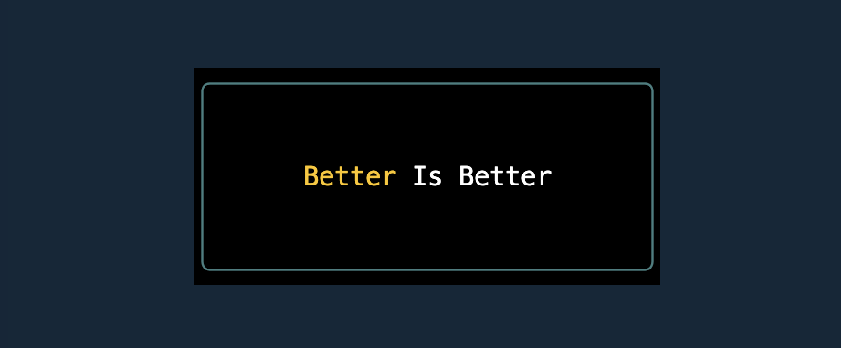

# boxen-better

> Create wonderful boxes in the terminal



This library is a fork of [`Boxen`](https://www.npmjs.com/package/boxen) by Sindre Sorhus. It's
identical in terms of functionality, but it has an additional option:
[`borderBackgroundColor`](#borderbackgroundcolor).

## Install

```bash
npm install boxen-better
```

## Usage

```javascript
import boxenb from 'boxen-better';

console.log(boxenb('better', { padding: 1 }));
/*
┌─────────────┐
│             │
│   better    │
│             │
└─────────────┘
*/

console.log(boxenb('better', { padding: 1, margin: 1, borderStyle: 'double' }));
/*

   ╔═════════════╗
   ║             ║
   ║   better    ║
   ║             ║
   ╚═════════════╝

*/

console.log(boxenb('better is preferable', { title: 'magical', titleAlignment: 'center' }));
/*
┌───── magical ──────┐
│better is preferable│
└────────────────────┘
*/
```

## API

### boxenb(text, options?)

#### text

Type: `string`

Text inside the box.

#### options

Type: `object`

##### borderColor

Type: `string`\
Values: `'black'` `'red'` `'green'` `'yellow'` `'blue'` `'magenta'` `'cyan'` `'white'` `'gray'` or a
hex value like `'#ff0000'`

Color of the box border.

##### borderStyle

Type: `string | object`\
Default: `'single'`\
Values:

- `'single'`

```
┌───┐
│foo│
└───┘
```

- `'double'`

```
╔═══╗
║foo║
╚═══╝
```

- `'round'` (`'single'` sides with round corners)

```
╭───╮
│foo│
╰───╯
```

- `'bold'`

```
┏━━━┓
┃foo┃
┗━━━┛
```

- `'singleDouble'` (`'single'` on top and bottom, `'double'` on right and left)

```
╓───╖
║foo║
╙───╜
```

- `'doubleSingle'` (`'double'` on top and bottom, `'single'` on right and left)

```
╒═══╕
│foo│
╘═══╛
```

- `'classic'`

```
+---+
|foo|
+---+
```

- `'arrow'`

```
↘↓↓↓↙
→foo←
↗↑↑↑↖
```

- `'none'`

```
foo
```

Style of the box border.

Can be any of the above predefined styles or an object with the following keys:

```javascript
{
	topLeft: '+',
	topRight: '+',
	bottomLeft: '+',
	bottomRight: '+',
	top: '-',
	bottom: '-',
	left: '|',
	right: '|'
}
```

##### borderBackgroundColor

Type: `string`\
Values: `'black'` `'red'` `'green'` `'yellow'` `'blue'` `'magenta'` `'cyan'` `'white'` `'gray'` or a
hex value like `'#ff0000'`

Color of the of the border background.

##### dimBorder

Type: `boolean`\
Default: `false`

Reduce opacity of the border.

##### title

Type: `string`

Display a title at the top of the box. If needed, the box will horizontally expand to fit the title.

Example:

```javascript
console.log(boxenb('foo bar', { title: 'example' }));
/*
┌ example ┐
│foo bar  │
└─────────┘
*/
```

##### titleAlignment

Type: `string`\
Default: `'left'`

Align the title in the top bar.

Values:

- `'left'`

```javascript
/*
┌ example ──────┐
│foo bar foo bar│
└───────────────┘
*/
```

- `'center'`

```javascript
/*
┌─── example ───┐
│foo bar foo bar│
└───────────────┘
*/
```

- `'right'`

```javascript
/*
┌────── example ┐
│foo bar foo bar│
└───────────────┘
*/
```

##### width

Type: `number`

Set a fixed width for the box.

_Note:_ This disables terminal overflow handling and may cause the box to look broken if the user's
terminal is not wide enough.

```javascript
import boxenb from 'boxen-better';

console.log(boxenb('foo bar', { width: 15 }));
// ┌─────────────┐
// │foo bar      │
// └─────────────┘
```

##### height

Type: `number`

Set a fixed height for the box.

_Note:_ This option will crop overflowing content.

```javascript
import boxenb from 'boxen-better';

console.log(boxenb('foo bar', { height: 5 }));
// ┌───────┐
// │foo bar│
// │       │
// │       │
// └───────┘
```

##### fullscreen

Type: `boolean | (width: number, height: number) => [width: number, height: number]`

Whether or not to fit all available space within the terminal.

Pass a callback function to control box dimensions:

```javascript
import boxenb from 'boxen-better';

console.log(
  boxenb('foo bar', {
    fullscreen: (width, height) => [width, height - 1],
  })
);
```

##### padding

Type: `number | object`\
Default: `0`

Space between the text and box border.

Accepts a number or an object with any of the `top`, `right`, `bottom`, `left` properties. When a
number is specified, the left/right padding is 3 times the top/bottom to make it look nice.

##### margin

Type: `number | object`\
Default: `0`

Space around the box.

Accepts a number or an object with any of the `top`, `right`, `bottom`, `left` properties. When a
number is specified, the left/right margin is 3 times the top/bottom to make it look nice.

##### float

Type: `string`\
Default: `'left'`\
Values: `'right'` `'center'` `'left'`

Float the box on the available terminal screen space.

##### backgroundColor

Type: `string`\
Values: `'black'` `'red'` `'green'` `'yellow'` `'blue'` `'magenta'` `'cyan'` `'white'` `'gray'` or a
hex value like `'#ff0000'`

Color of the background.

##### textAlignment

Type: `string`\
Default: `'left'`\
Values: `'left'` `'center'` `'right'`

Align the text in the box based on the widest line.

## Maintainer

- [Thorn Duke](https://github.com/ThornDuke)
